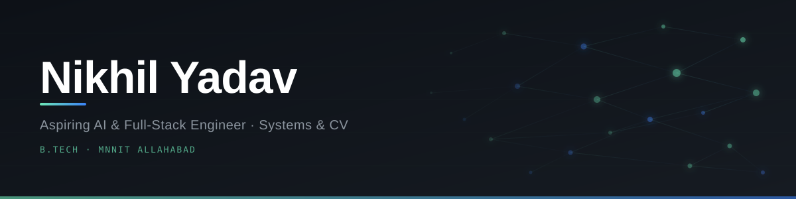

  

 

&nbsp;&nbsp;&nbsp;

&nbsp;&nbsp;&nbsp;

&nbsp;&nbsp;&nbsp;

 

&nbsp;

&nbsp;

&nbsp;

## About

I'm a B.Tech student at **MNNIT Allahabad** and an **aspiring AI & Full-Stack Engineer** building systems where the intelligence is load-bearing, not decorative.

My work spans **multi-agent RAG pipelines, computer vision, DevSecOps automation**, and the full-stack infrastructure connecting them. I care about building reliable systems that perform correctly under real conditions — not just in demos.

**5× first-place** finishes across AI/ML competitions at IIT BHU and MNNIT Allahabad, won under tight hackathon deadlines against fresh problem statements.

## 🛠 Tech Stack

**Languages**

**Frontend**

**Backend & Databases**

**AI / ML**

 

**DevOps & Tools**

## 🚀 Featured Projects

### [`VulnCraft`](https://github.com/Nikhil-Yadav15/VulnCraft) — No-Code DevSecOps Pipeline Builder

&nbsp;&nbsp;

&nbsp;

&nbsp;

&nbsp;

Security testing gets skipped because wiring it into CI requires a specialist. **VulnCraft** removes that barrier — drag, drop, and connect security tools into a pipeline. A GitHub App runs it on every PR automatically.

- Integrates **OWASP ZAP · Nmap · Nikto · SQLMap · WPScan · Gobuster · Bandit · Safety** as Dockerized microservices
- Full closed loop: detect → open issue → validate PR → redeploy → re-verify
- **LLM layer** translates raw scan output into developer-readable action items
- Per-user isolation at the scan service level — concurrent pipelines never interfere

`Docker` `React Flow` `GitHub Apps` `WebSockets` `DAST` `LLM` `Node.js`

### [`NextStep`](https://github.com/Nikhil-Yadav15/NextStep) — AI Career & Interview Copilot

&nbsp;&nbsp;

&nbsp;

&nbsp;

&nbsp;

&nbsp;

&nbsp;

&nbsp;

Full career prep suite — not another single-purpose chatbot. Built on a **multi-agent, RAG-based architecture** with **Qdrant** semantic search, so every recommendation is grounded in real context.

- **CNN + YOLO** vision pipeline analyses confidence and body language live during mock interviews
- **LangGraph** agents drive roadmap generation, skill-gap analysis, and adaptive test creation
- **RAG** over **Qdrant** for personalised resource recommendations
- Polyglot persistence — **MongoDB · Qdrant · Redis** — each used for what it's actually good at
- WebSocket streaming + Redis caching for sub-second AI response delivery

`Python` `Next.js` `TensorFlow` `OpenCV` `LangGraph` `Qdrant` `Redis` `MongoDB` `PostgreSQL` `FastAPI`

### [`DevBoard`](https://github.com/Nikhil-Yadav15/ElevendevHub) — Collaborative Developer Hub

&nbsp;&nbsp;

&nbsp;

&nbsp;

A shared workspace for developers — projects, resources, and tooling in one place. Real-time collaboration, role-based auth, and a clean developer-first UI.

`Full-Stack` `Real-Time` `Auth` `Team Collaboration`

## 🏆 Achievements

| Competition | Rank |
|---|:--:|
| **HackItOut**, AI/ML · **IIT BHU** | 🥇 **Rank 1** |
| **Google Developer Hackathon** · **MNNIT** | 🥇 **Rank 1** |
| **CodeSprint**, AI/ML · **MNNIT** | 🥇 **Rank 1** |
| **Turing's Playground**, AI/ML · **MNNIT** | 🥇 **Rank 1** |
| **RoboSoccer** · InnoDev · **MNNIT** | 🥇 **Rank 1** |
| **Hacktivate**, AI/ML | 🥈 **Rank 2** |
| **Hack36 9.0** · **MNNIT** (300+ teams) | 🏅 **Rank 8** |

## 🔭 Currently Exploring

&nbsp;

 

 

 

<picture>
  <source media="(prefers-color-scheme: dark)"
    srcset="https://raw.githubusercontent.com/Nikhil-Yadav15/Nikhil-Yadav15/main/output/github-snake-dark.svg">
  <source media="(prefers-color-scheme: light)"
    srcset="https://raw.githubusercontent.com/Nikhil-Yadav15/Nikhil-Yadav15/main/output/github-snake.svg">
  
</picture>

  

> **Intelligence without reliability is just a demo —**
> **the hard part is making it work when it matters.**

 

**Actively seeking AI Engineering & Full-Stack internships and entry-level opportunities.**

&nbsp;&nbsp;&nbsp;

&nbsp;&nbsp;&nbsp;

&nbsp;&nbsp;&nbsp;

